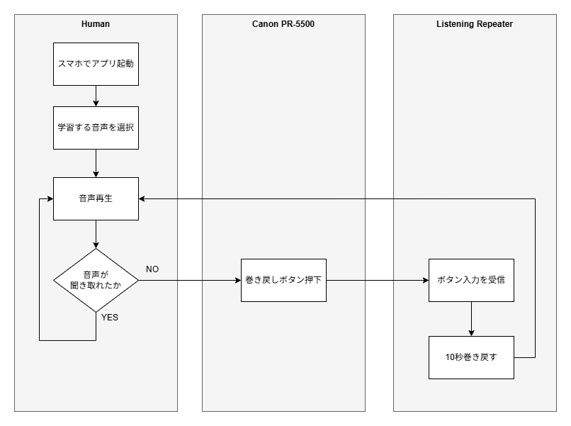
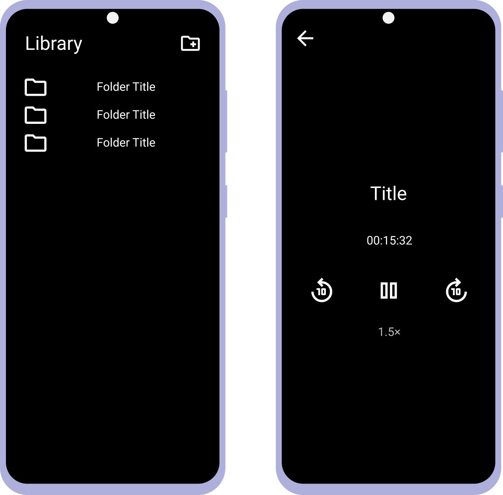
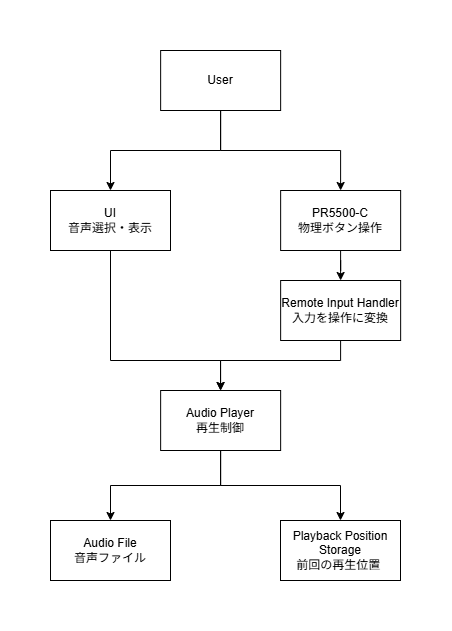

# Listening Repeater

## Background

英語のリスニング学習を行う中で、聞き取れなかった箇所を繰り返し聞くために10秒巻き戻しを頻繁に利用していた。
しかし、既存の音楽プレーヤーでは、巻き戻しのたびにスマートフォンの画面を見て操作する必要があり、学習への集中が途切れてしまうことがあった。実際に自分で利用する中で、「目を閉じたまま、ボタン操作だけでリスニング学習できる環境が欲しい」と感じたため、Listening Repeaterを開発する。

## User Flow

本章では、Listening Repeaterの主要な利用シナリオを示す。一時停止や次の曲への移動などの補助的な機能は対象外とし、本アプリの目的である「聞き取れなかった箇所を繰り返し聞く」という学習サイクルに焦点を当てる。

利用者はスマートフォンでアプリを起動し、学習する音声を選択して再生を開始する。リスニング中に音声を聞き取れなかった場合は、Canon PR-5500の巻き戻しボタンを使用して10秒巻き戻しを行い、同じ箇所を繰り返し聞く。Listening RepeaterはPR-5500からのボタン入力を受信し、音声を10秒巻き戻した後、音声再生を継続する。

なお、PR5500-Cを選定した理由は、リング状のデバイスを指にはめたまま操作できるため、ランニング中や目を閉じた状態でも扱いやすいと考えたためである。

**しかし、実際にアプリを開発して動作検証を行った結果、PR5500-Cでは当初想定していた要件を満たせないことが判明した。この経緯については「Lessons Learned」で詳しく述べる。**

## Requirements

#### Functional Requirements

- 音声の再生／一時停止
- 音声選択
- 10秒巻き戻し／10秒早送り
- 前回の再生位置から再開する
- PR5500-Cで操作する
- 前の音声に移動する（長押し）／次の音声に移動する（長押し）

#### FunNon-functional Requirements

- 目を閉じた状態でも操作可能であること。
- 学習中にスマートフォンの画面を見る必要がないこと。
- オフライン環境で利用できること。

## Screen Design Concept

英語リスニング学習に特化した、シンプルでミニマルなUIを採用する。

本アプリはPR5500-Cによる操作を前提としており、学習中にスマートフォンの画面を見る必要がないことを目指す。そのため、画面には必要最低限の情報と機能のみを配置し、学習への集中を妨げない設計とする。

## Screen Transition Diagram

本アプリは、Audio List Screen と Playback Screen の2画面で構成する。

## Architecture

初期段階では過度な責務分割は行わず、必要最低限の機能を優先して実装する。機能追加や保守性の要求に応じて、段階的に責務を分離していく。

アプリは以下のコンポーネントで構成する。

- **UI**
    - 曲名や再生状態など、ユーザーに必要な情報を表示する。
    - 必要最小限の画面を提供し、学習への集中を妨げない設計とする。
- **Audio Player**
    - 音声の再生、一時停止、10秒巻き戻し、10秒早送りなどの再生制御を行う。
    - 音声再生にはMedia3（ExoPlayer）を利用する。
- **Remote Input Handler**
    - PR5500-Cからの入力を受け付ける。
    - ボタンの短押しや長押しを判定し、対応する再生操作へ変換する。
- **Playback Position Storage**
    - 音声ファイルごとの再生位置を保存する。
    - アプリ再起動後も前回の再生位置から再開できるようにする。

図示すると以下のようになる

## Data Design

本アプリでは、音声ファイルそのものはアプリ内に保存せず、ユーザーが選択したフォルダ内のMP3ファイルを参照する。

アプリ側では、選択したフォルダ、最後に再生した音声、再生位置、再生速度など、再生状態の復元に必要な情報を保存する。

| Data Name | Type | Description | Save Timing |
| --- | --- | --- | --- |
| selectedFolderUri | String | ユーザーが選択した音声フォルダのURI | フォルダ選択時 |
| lastPlayedAudioUri | String | 最後に再生した音声ファイルのURI | 音声選択時 |
| playbackPositionMs | Long | 前回の再生位置。単位はミリ秒 | 一時停止時／アプリ終了時 |
| playbackSpeed | Float | 再生速度 | 再生速度変更時 |

### Storage

再生状態は、Android端末内のアプリ専用領域にDataStoreを使用して保存する。

DataStoreには、再生状態を復元するためのKey-Value形式のデータを保存する。

音声ファイル自体はDataStoreには保存せず、選択されたフォルダ内のMP3ファイルを参照する。

## Lessons Learned

開発当初は、Canon PR5500-Cを利用してバックグラウンド再生中の音声を操作することを想定していた。そのため、Bluetoothリモコンからの入力を受信できる音声プレーヤーとして Listening Repeater を実装した。

実装および動作検証を進める中で、PR5500-Cから送信される入力イベントを調査したところ、期待していた Android 標準のメディアコントロールイベント（MEDIA_PREVIOUS など）が送信されていないことが分かった。

このため、アプリ側の実装だけではバックグラウンド再生中の巻き戻し操作を実現することが難しく、問題の原因はアプリではなく入力デバイス側にあることが判明した。

そこで Android 標準のメディアコントロールに対応したエレコム製 Bluetooth リモコン(**LAT-RC01BK**)を購入して検証したところ、私が作成したListening Repeaterではなく、既存のアプリであるSmart AudioBook Player においてバックグラウンド再生中でも正常に巻き戻し操作が動作した。

**結果として、当初解決したかった課題は Listening Repeater ではなく、Smart AudioBook Player と適切なBluetoothリモコンの組み合わせで解決してしまった。**

これで熱が完全に冷めてしまったのでコードのリファクタリングまではやりません！！

